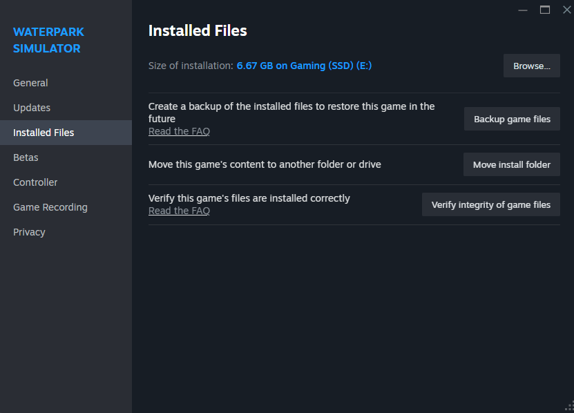

# Stream Surfers

Stream Surfers is a MelonLoader Unity mod for the Unity-based Steam game, [Waterpark Simulator](https://store.steampowered.com/app/3293260/Waterpark_Simulator/).

Its primary focus is on Twitch streamers who wish to add an element of interactivity with their audience, by allowing Twitch chatters to appear in the game as park patrons.

> [!Note]
> If you are a user that just cares about the mod and not how it was developed, feel free to skip the “How It Works” section, unless that sounds of interest to you!

## Table of Contents

* [Prerequisites](#prerequisites)
* [Getting Started](#getting-started)
* [Configuration](#configuration)
  * [`Enable Mod`](#enable-mod)
  * [`Channel Name`](#channel-name)
  * [`Blocklisted Chatters`](#blocklisted-chatters)
  * [`Message Command`](#message-command)
  * [`Subscriber Weight`](#subscriber-weight)
  * [`Queue Size`](#queue-size)

## Prerequisites

* [Waterpark Simulator](https://store.steampowered.com/app/3293260/Waterpark_Simulator/)
* [MelonLoader](https://melonwiki.xyz/#/?id=requirements)

## Getting Started

Before installing the mod, [install MelonLoader](#prerequisites) for Waterpark Simulator and run the game. This may take some time, as MelonLoader will decompile the game first. Once the game loads and the main menu appears, close the game.

Download the latest version of Stream Surfers from our [Releases page](https://github.com/ReservedKeyword/StreamSurfers/releases), drag-and-dropping `StreamSurfers.dll` and _all its accompanying dependencies_ into the `Mods` directory, loading within your game's Steam directory.

For reference, if you right-click Waterpark Simulator in Steam, click Properties, then click on Installed Files, you should see similar to the following image. In this image, click on "Browse..." and you File Explorer will open to your game's Steam directory.

Start Waterpark Simulator again, allowing the game *and mod* time to fully launch, before exiting the game (again) once reaching the main menu.

Proceed to the next section in this document to learn how to configure the mod!

## Configuration

The configuration file can be found in your game's root directory, a level above where the mod was installed.

The path will look similar to `/path/to/game/UserData/MelonPreferences.cfg`, where `/path/to/game` is the path to the Waterpark Simulator game directory. (See image above on how to locate where the game was downloaded.)

There are two sections (categories) that belong to the Stream Surfers mod:

* `StreamSurfers_General`

* `StreamSurfers_TwitchIntegration`

All mod configuration options are as follows:

### `StreamSurfers_General`

#### `Enable Mod`

Set to `true` if you want the mod to load when the game launches, otherwise set it to `false`.

### `StreamSurfers_TwitchIntegration`

#### `Channel Name`

The username of the Twitch channel the mod should connect to in order to process the message command (see below).

Since the mod effectively enters the chat room as an anonymous, read-only user, there is no authentication needed.

#### `Blocklisted Chatters`

A comma-separated list of chatters whose messages will be fully ignored by the mod.

Though you may add whomever you wish to this list, its original intent was to allow explicitly blocking messages from certain users, such as bots, like Stream Elements or Streamlabs.

#### `Message Command`

The command that registers a Twitch chatter’s intent to be in the game. This string can be set to whatever you like, though it is recommended to be fairly unique to reduce the likelihood of unwanted messages getting caught.

As a quick aside, a Twitch chatter’s message is inspected to *contain* this phrase, meaning that it does not have to be their full message, nor does it have to begin with an exclamation mark (!).

#### `Subscriber Weight`

A weight value that can be used to determine the "luck" of subscribers when getting drawn. Non-subscribers have a static weight of 1.0.

* If you would like, for example, subscribers to have 20% more luck than non-subscribers, this value should be set to `1.2`.

* If you would like subscribers to have the same luck as non-subscribers, this value should be set to `1.0`.

#### `Queue Size`

The maximum number of unique chatters that should be selected from at any given time. Chatters will always be chosen at "[random](https://en.wikipedia.org/wiki/Pseudorandomness);" this value simply defines the maximum number of unique chatters you would like the mod to choose from.
